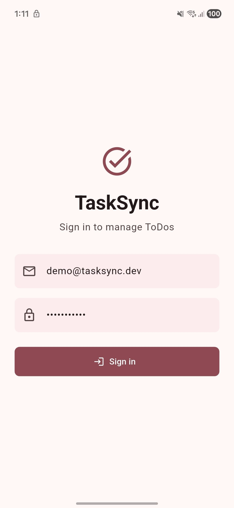
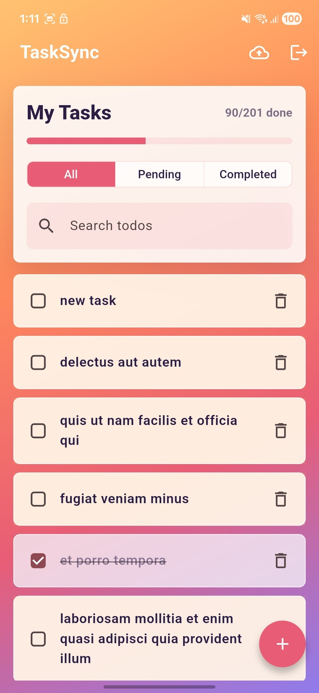
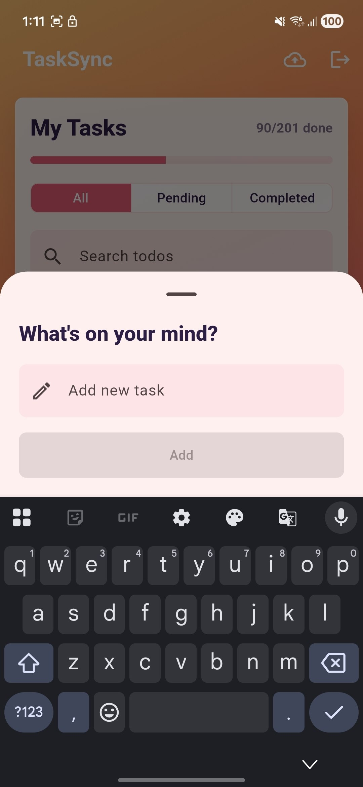

# TaskSync

A simple Flutter todo app built using the JSONPlaceholder API.

This was done as part of an assignment, but I tried to structure it close to how I’d normally build a feature with clean separation of layers, BLoC for state management, API integration, and basic offline support.

---

## Demo

Video: https://drive.google.com/file/d/18bGQsLGndRKE3ISD9C_okgbyen7_E3Lv/view?usp=sharing

---

## Demo Login

```
Email: demo@tasksync.dev  
Password: password123
```
---

## Screenshots

<p align="center">
  
  
  
</p>

---

## How to Run

The project uses FVM with Flutter `3.41.6`.

```sh
.fvm/flutter_sdk/bin/flutter pub get
.fvm/flutter_sdk/bin/dart run build_runner build --delete-conflicting-outputs
.fvm/flutter_sdk/bin/flutter run
```

Optional:

```sh
.fvm/flutter_sdk/bin/flutter analyze
.fvm/flutter_sdk/bin/flutter test
```

Debug APK:

```
build/app/outputs/flutter-apk/app-debug.apk
```

---

## Features

* View todos (from API + cached locally)
* Add new task
* Mark task as complete/incomplete
* Delete task (with confirmation)
* Search tasks
* Filter (All / Pending / Completed)
* Pull to refresh
* Offline support with local cache
* Optimistic updates for better UX
* Manual sync button
* Auto sync when connection is restored
* Simple mock login

---

## Project Structure

The project is split into a few main layers:

```
lib/
 ├── app/              → routing and setup
 ├── core/             → shared utilities
 ├── features/
 │    ├── auth/
 │    └── tasks/
 │         ├── data/
 │         ├── domain/
 │         └── presentation/
```

Inside the tasks feature:

* `data` handles API + local storage
* `domain` contains the entity and repository contract
* `presentation` includes UI + BLoC

UI is broken into smaller widgets like task list, task tile, add task sheet, and skeleton loader.

---

## BLoC

`TaskBloc` handles all task-related actions:

* loading tasks
* adding tasks
* updating completion
* deleting tasks
* search and filter
* syncing pending changes

State is kept simple using a single `TaskState` with a status (`initial`, `loading`, `success`, `error`) instead of multiple state classes.

To keep the bloc readable, some responsibilities are moved out:

* connectivity handling
* user-facing messages
* list mutation helpers (for optimistic updates)

---

## API

Using JSONPlaceholder endpoints:

```
GET    /todos
POST   /todos
PATCH  /todos/:id
DELETE /todos/:id
```

Dio is used for networking with basic setup for base URL, error handling, and logging.

---

## Offline Support

A simple offline-first approach:

* Todos are cached locally using `shared_preferences`
* UI updates immediately (optimistic updates)
* Changes are stored as pending operations
* Sync happens:

  * manually (via sync button)
  * automatically when internet is restored

Since JSONPlaceholder doesn’t persist changes, local data is treated as the source of truth.

---

## Assumptions

* Login is mocked
* Search is handled locally
* API is treated as non-persistent
* `shared_preferences` is used for simplicity (can be replaced with Hive/Drift in a real app)

---

## Challenges

* JSONPlaceholder doesn’t actually persist writes, so local state handling was needed
* Keeping offline sync simple without overcomplicating the logic
* Avoiding making the BLoC too heavy
* Balancing UI polish with time constraints

---

